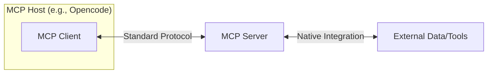

# Building a Local MCP Server in TypeScript: Best Practices & Documentation

## Introduction: The "Last Mile" Problem in AI
While LLMs are proficient in reasoning and coding, they are often disconnected from real-world data (static datasets). Introduced by Anthropic in late 2024, the **Model Context Protocol (MCP)** is an open standard that connects AI applications to external systems, providing a secure and scalable way to communicate with data sources and tools.

## What is an MCP Server?
An MCP Server acts as a standardized gateway between an AI application (Client) and external capabilities. It provides controlled access to data or specialized tasks, decoupling the AI's core logic from implementation details.

## Technical Principles & Architecture
The architecture follows a client-server-host model using **JSON-RPC 2.0**:
- **MCP Host:** The main AI application (e.g., Opencode, Claude Code).
- **MCP Client:** The bridge within the host maintaining a one-to-one connection with a server.
- **MCP Server:** The program exposing tools and data.

### Transports
- **Local:** Uses standard input/output (**stdio**) pipes.
- **Remote:** Uses HTTP with **Server-Sent Events (SSE)** for streaming.



## Core Primitives: Tools, Resources, and Prompts
MCP servers expose capabilities through three core primitives:

| Primitive | Description | Practical Example |
| :--- | :--- | :--- |
| **Tools** | Executable functions the LLM can call (requires user approval). | `calculate_bmi(w, h)`, `send_email(to, body)` |
| **Resources** | Data identified by URIs that the AI can retrieve. | `file:///logs/app.log`, `db://schema/users` |
| **Prompts** | Pre-written templates guiding the user or LLM. | `code-reviewer`, `sql-query-generator` |

## Common Use Cases
- **Data Retrieval:** Injecting real-time context from cloud storage or knowledge bases.
- **Automation:** Enabling agents to execute tools (e.g., CRM updates, calendar events).
- **Local Access:** Providing secure, sandboxed access to local files and directories.
- **Web/API Integration:** Wrapping REST APIs in a consistent interface.
- **Collaboration:** Orchestrating multi-agent workflows.

## Advanced Features
- **Sampling:** Servers can ask the AI model to generate content during a workflow.
- **Elicitation:** Servers can pause to request additional user input.

## Step-by-Step Guide: TypeScript + Bun
1. **Initialize Project:**
   ```bash
   mkdir my-mcp-server && cd my-mcp-server
   bun init -y
   ```
2. **Install Dependencies:**
   ```bash
   bun add @modelcontextprotocol/sdk zod
   ```
3. **Write the Server (`index.ts`):**
   Use the `McpServer` class to register tools, resources, and prompts (see README.md for a full template).
4. **Test & Run:**
   Test by sending JSON-RPC messages to `stdin` or via a client like Claude Desktop.

## Best Practices
### Architectural & Security
- **Single Responsibility:** Build small, focused servers.
- **Clear Descriptions:** Crucial for the LLM's tool selection logic.
- **Least Privilege:** Grant only necessary permissions.
- **Input Validation:** Rigorously validate all inputs (e.g., using Zod).
- **Logging:** Use structured logging to `stderr` (logging to `stdout` breaks stdio transport).

### Implementation
- Use official SDKs and validators.
- Implement structured error handling.
- Version your tools for compatibility.
- Write unit and integration tests using the SDK's test client.

## Community Resources
- [Official MCP Documentation](https://modelcontextprotocol.io/)
- [Reference Servers](https://github.com/modelcontextprotocol/servers)
- [Awesome MCP Servers List](https://github.com/wong2/awesome-mcp-servers)
