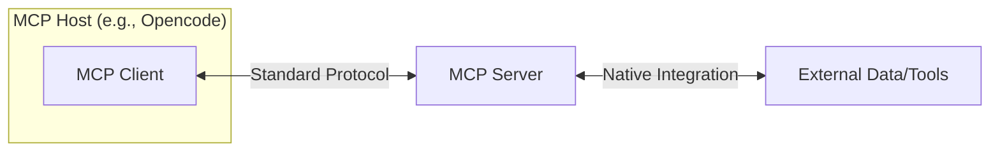
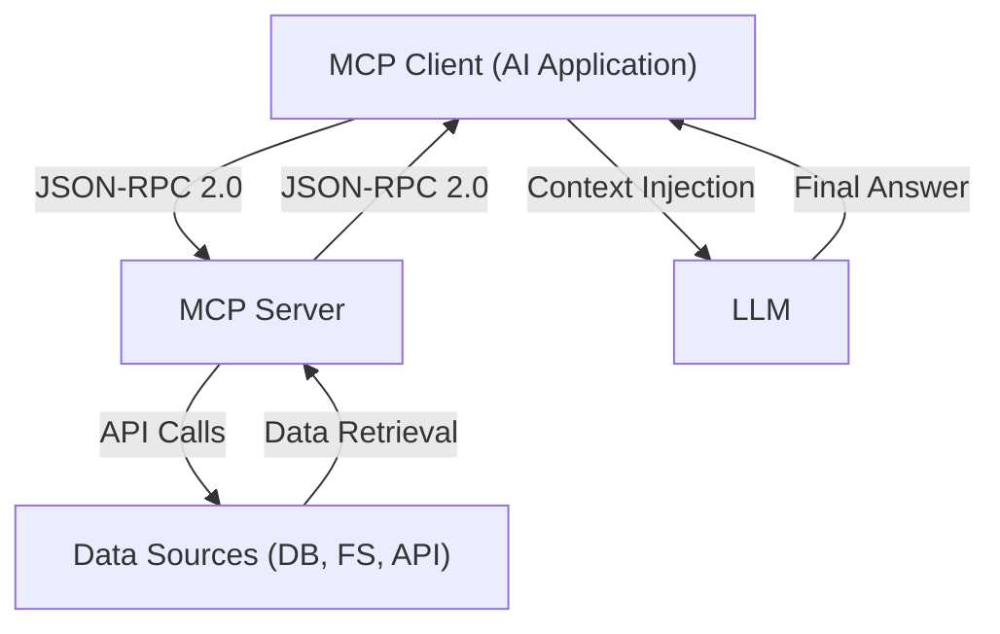

# Building a Local MCP Server in TypeScript: Best Practices, Documentation, and Templates

## Introduction: The "Last Mile" Problem in AI

AI engineers have witnessed the exponential growth of Large Language Models (LLMs). They reason, write, and code with astonishing proficiency. Yet, in 2024 a fundamental limitation persisted: they were disconnected from the real world : trained on *static datasets*, LLMs were disconnected from up-to-date data : databases, APIs, or specific business knowledge.

Introduced by Anthropic in late 2024, **MCP** (for Model Context Protocol) is [an open standard for connecting AI applications to external systems](https://www.anthropic.com/news/model-context-protocol). It provides a universal, secure, and scalable way for AI systems to communicate with external data sources and tools. 

## What is an MCP Server?

A Model Context Protocol (MCP) Server is a program that acts as a standardized gateway between an AI application and external capabilities. In essence, MCP servers act as *bridges* that give LLMs *controlled access* to specific data sources or enable them to perform specialized tasks.

In the MCP architecture, the server's role is to advertise and provide access to specific functionalities. 

An AI application, acting as an MCP client, connects to this server to discover and invoke these functionalities. This decouples the AI's core logic from the implementation details of the tools it uses, making the entire system more modular, secure, and scalable.

## Technical Principles & Architecture

To effectively build and manage an MCP server, you must understand its underlying architecture. The protocol is built on a client-server model and is composed of distinct layers and primitives that govern communication.

### The Client-Server-Host Model

The MCP architecture consists of three key participants:

1. **MCP Host:** The main AI application, such as Opencode, Claude Code or any agentic system. It manages connections to one or more MCP servers.
2. **MCP Client:** A component within the host that establishes and maintains a dedicated, one-to-one connection with a single MCP server.
3. **MCP Server:** The program you build. It exposes data and tools to a connected client. 

All communication between the MCP client and server uses a **standardized JSON-RPC 2.0 message format**. JSON-RPC provides a structured way to encode requests and responses, making the protocol language-agnostic and easy to implement. The MCP client and server communicate via either a **local channel** (like standard input/output pipes) or an **HTTP connection** with **Server-Sent Events (SSE)** for streaming responses. This design choice is flexible: for local tools, MCP uses a simple I/O pipe (so the server can be launched in-process or alongside the AI host), whereas for remote tools, it uses HTTP (so the server can be on a different machine or network) with SSE to stream results back in real time.





## Common Use Cases for MCP Servers

MCP servers are incredibly versatile and can be applied in a wide range of scenarios. Here are some common use cases where MCP servers are useful:


### Data Retrieval and Context Injection:

MCP servers allow AI agents to fetch relevant data on demand. For instance, an AI assistant can query an MCP server to retrieve a document from a cloud storage service (like Google Drive or Dropbox) or to look up information from specialized knowledge bases. By providing the AI model with up-to-date data, MCP servers help reduce incorrect information generation (hallucinations) and improve the accuracy of responses. Agents can access rich metadata and governed datasets in a standardized way, ensuring reliable, auditable, and scalable data integration.

### Tool Execution and Automation:

MCP servers enable AI agents to [execute external tools](https://www.anthropic.com/engineering/code-execution-with-mcp) or perform actions on behalf of the user. A common example is an AI agent that can invoke an MCP server to send an email, create a calendar event, or update a record in a CRM system. This turns AI assistants into *task runners* that can interact with the real world. For example, an MCP server for a calendar might expose functions to create events or get today’s schedule, and an AI agent can call those functions as needed. MCP’s protocol ensures that these actions are done securely and in a controlled manner, with user approval and context provided.

MCP’s structured context retrieval and multi-step interactions (like [sampling and elicitation](https://modelcontextprotocol.io/docs/concepts/sampling)) can enhance how the AI uses this knowledge.

### Local File System Access:

MCP Servers can grant AI agents access to local files and directories in a secure, sandboxed way.  For example, an MCP server for the local filesystem might provide tools to read a file, list directory contents, or write a file. By setting a *root directory* or access scope, the server ensures the AI can only access a specific folder, preventing unauthorized access to other parts of the system. This enables features like an AI assistant that can open and summarize a text file on your computer or generate a new file based on user instructions.

### Web and API Integration:

MCP servers can connect AI agents to external web services or APIs. For instance, you could build an MCP server that wraps a REST API to fetch weather data, XML RSS news feeds, or product information. 
MCP servers provide a consistent interface to call these APIs, while handling authentication and data retrieval behind the scenes.

### Multi-Agent Collaboration and Workflow Orchestration:

MCP servers can be used in multi-agent systems to allow one AI agent to interact with another or with a central service. For example, one agent might use an MCP server to coordinate with a task execution server that handles complex operations. This is useful in scenarios like automated workflows where one AI decides what action to take and another (or a server) executes it. MCP’s ability to manage context and state across interactions helps in building more sophisticated agent architectures.

The following diagram illustrates this architecture:



## Detailed Specifications

### Transports

*   **JSON-RPC 2.0 Protocol:** All communication between tyhe MCP Client and server is based on [JSON-RPC 2.0 messages](https://www.a2aprotocol.org/en/docs/json-rpc-2-0). The protocol handles method calls and responses, error handling, and even notifications (like streaming results).
*   **Local vs. Remote Transport:** 
  * For local MCP servers, MCP uses **stdio** transport relying on standard stdin/stdout (stdio) pipes. The server is often launched as a separate process that communicates with the host via standard I/O. 
  * For remote MCP servers, MCP uses HTTP requests with Server-Sent Events. This allows for scaling MCP servers independently and accessing them over a network.

### Core Primitives: Tools, Resources, and Prompts

The MCP server exposes its capabilities through three core primitives:

- **Tools:** Executable functions that the LLM can call (with user approval). Examples :  `get_forecast`, `create_customer_invoice`..
- **Resources:** Some pieces of data identified by URIs that the AI can retrieve. Examples : file contents, database schemas.
- **Prompts:** Pre-written templates that guide the user or the LLM toward accomplishing a specific task.

### Advanced Features: 

MCP also supports advanced interaction patterns. For instance, **sampling**, where an MCP server can ask the AI model to generate content as part of a workflow. Another feature is **elicitation**, where a server can pause an operation and request additional input from the user. These capabilities make AI-tool interactions more interactive and “agent-like”.

## Step-by-Step Guide to Building a TypeScript MCP Server

Building an MCP server in TypeScript involves several steps:

1.  **Set Up a New Project:** Create a new directory and initialize a project. You can use `bun`.
    ```bash
    mkdir my-mcp-server
    cd my-mcp-server
    bun init -y
    ```
2.  **Install Required Dependencies:** You’ll need the [official MCP TypeScript SDK](https://github.com/modelcontextprotocol/typescript-sdk) and `zod` for validation:
    ```bash
    bun add @modelcontextprotocol/server zod
    ```
3.  **Create Project Structure:** Organize your files:
    ```bash
    my-mcp-server/
    ├── src/
    │   ├── index.ts         # Main server entry point
    │   └── tools/           # Directory for your tools
    ├── tsconfig.json        # TypeScript configuration
    └── package.json
    ```
4.  **Configure TypeScript:** Create a `tsconfig.json` with settings to compile to a dist directory.
5.  **Write the MCP Server Code (index.ts):**
    ```typescript
    import { Server, StdioServerTransport } from "@modelcontextprotocol/server";

    const server = new Server();

    server.registerTool(
       "greet",
       {
           title: "Greet",
           description: "Greets the user with a personalized message",
           inputSchema: {
               name: { type: "string", description: "The name of the person to greet" },
           },
       },
       async (args) => {
           return `Hello, ${args.name}! Nice to meet you.`;
       }
    );

    const transport = new StdioServerTransport();
    server.useTransport(transport);

    server.start().then(() => {
       console.log("MCP server is running and ready to accept connections.");
    });
    ```
6.  **Run and Test the Server:** Compile and run your code. Add a script to `package.json` to build and run the server:
    ```json
    "scripts": {
       "build": "tsc",
       "start": "bun run build && bun dist/index.js"
    }
    ```
    Then execute:
    ```bash
    bun start
    ```
    You can test it by sending JSON-RPC messages to `stdin`. For example, listing tools:
    ```json
    {
       "jsonrpc": "2.0",
       "id": 1,
       "method": "mcp_list_tools"
    }
    ```
7.  **Integrate with an AI Client:** For example, in Claude Desktop, add your server to `claude_desktop_config.json`.
8.  First, build your server using `bun run build`. This generates the JavaScript code in the `dist` folder.
9.  Copy the absolute path of the compiled file and configure the host:
    ```json
    "mcpServers": {
       "my-server": {
           "type": "stdio",
           "command": "bun",
           "args": ["/absolute/path/to/dist/index.js"],
           "env": {}
       }
    }
    ```
    Save and restart your client. You should now see the `greet` tool available.


## Best Practices for MCP Server Development

### Architectural Best Practices
- **Single Responsibility Principle:** Create small, focused servers (e.g., `DatabaseServer`, `FileSystemServer`).
- **Clear Descriptions:** Precise tool descriptions are crucial for the LLM to choose the right tool.
- **Containerization:** Use Docker for consistent deployment.

### [Security Best Practices](https://steipete.me/posts/2025/mcp-best-practices)
- **Authentication:** Always implement authentication for remote servers (OAuth 2.0 recommended).
- **Least Privilege:** Grant only necessary permissions to the server's service account.
- **Input Validation:** Rigorously validate all tool inputs.
- **Auditing:** Log every tool call for security and troubleshooting.

### Implementation
*   **Use the Official SDK and Validators:** Leverage the official MCP TypeScript SDK. 
*   **Input Validation and Error Handling:** Always validate inputs (use `zod` for input validation). If an error occurs, throw an `McpError` object to ensure structured responses.
*   **Secure Inputs and Authentication:** Treat AI inputs as untrusted. Restrict access scopes. For network-exposed servers, use an API gateway or reverse proxy. Use `require_approval` for sensitive tools.
*   **Tool Description and Documentation:** Provide human-readable titles and detailed descriptions to help the LLM decide when to use the tool.
*   **Versioning and Compatibility:** Version your tools as logic changes so clients can handle updates gracefully.
*   **Testing and Quality Assurance:** Write unit tests for tools and integration tests using the SDK's **test client**.
*   **Logging and Monitoring:** Use structured logging (e.g., `pino`) to record tool calls and errors.

## MCP Server vs. Other Frameworks

### [MCP vs. OpenAI Function Calling](https://developers.openai.com/api/docs/guides/tools-connectors-mcp/)
OpenAI Function Calling is a model-specific feature for a single request-response cycle. MCP is a persistent, stateful, and model-agnostic protocol that supports dynamic discovery and bidirectional communication.

## Community Resources and Further Reading

### Must-Read Foundations
*   **Official MCP Documentation:** Detailed guides and developer documentation at [modelcontextprotocol.io](https://modelcontextprotocol.io/).
*   **[A Deep Dive Into MCP](https://a16z.com/a-deep-dive-into-mcp-and-the-future-of-ai-tooling/):** Analysis of the future of AI tooling and the role of the protocol.
*   **[What is MCP?](https://www.atscale.com/glossary/model-context-protocol-mcp/):** A clear definition and overview of use cases.
*   **[Anthropic Engineering Posts](https://www.anthropic.com/engineering):** Deep dives into code execution and the future of AI tooling.

### Implementation and Reference
*   **[GitHub's official MCP Server](https://github.com/github/github-mcp-server):** A high-quality reference implementation for production.
*   **[Official Reference Servers](https://github.com/modelcontextprotocol/servers):** Implementations for PostgreSQL, SQLite, Google Drive, and more.
*   **[Understanding Authorization in MCP](https://modelcontextprotocol.io/docs/tutorials/security/authorization):** Guide on securing resources and user data.

### Community and Tutorials
*   **[Awesome MCP Servers](https://github.com/wong2/awesome-mcp-servers):** A curated list of servers and resources.
*   **[Reddit MCP Community](https://www.reddit.com/r/mcp/):** Discussion, complex use cases, and community support.
*   **[AI Agents: MCP Series](https://medium.com/@vipra_singh/ai-agents-model-context-protocol-mcp-part-11-832ef8682581):** In-depth analysis of agentic workflows by Vipra Singh.
*   **[Build an MCP (Ogment)](https://www.ogment.ai/blog/build-an-mcp):** Practical insights on the building process and developer experience.
